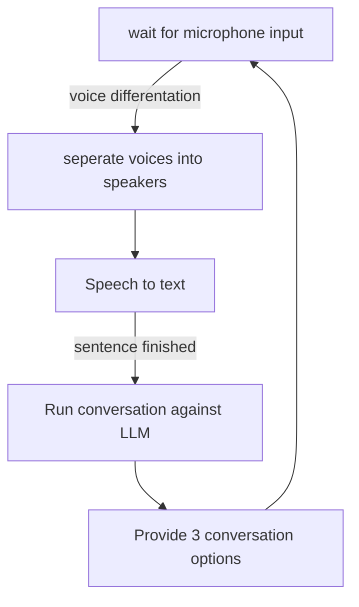
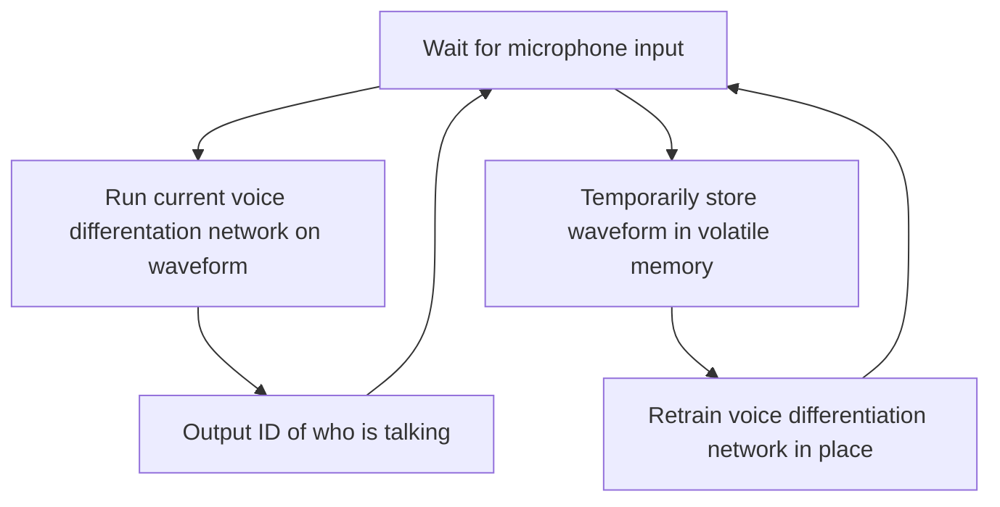

# IDS2935 Design Challenge 2
For this design challenge, the purple group is designing an app to assist those with difficulty socializing

## Build
### Linux
```
python -m venv .venv
source .venv/bin/activate
pip install -r requirements.txt
pip install torch torchvision torchaudio --index-url https://download.pytorch.org/whl/cu118
```
### Windows
```
python -m venv .venv
.\.venv\Scripts\activate
pip install -r requirements.txt
pip install torch torchvision torchaudio --index-url https://download.pytorch.org/whl/cu118
```

## App Flowchart


## Voice Differentiation Flowchart (Not yet implemented)



## Issue with LLM
The LLM by default does not support enough tokens, need to do a small override
```
.venv\Lib\site-packages\transformers\pipelines\text_generation.py
```
add at line 369 
```
generate_kwargs["generation_config"].max_new_tokens = 100
```